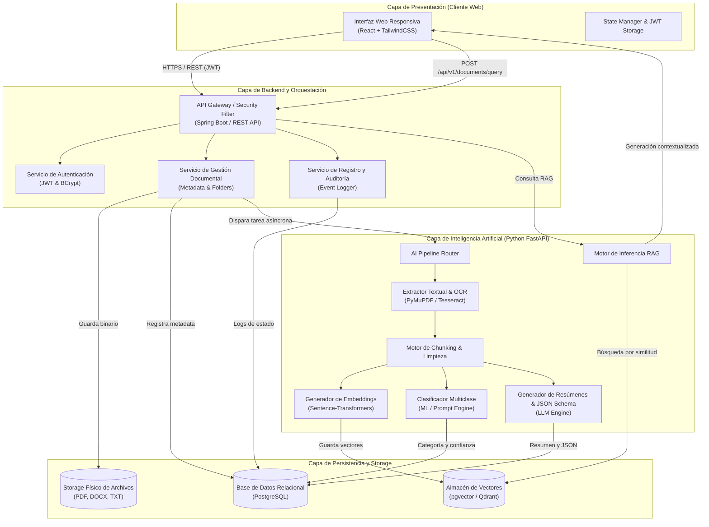
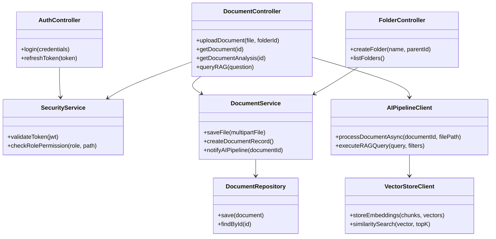
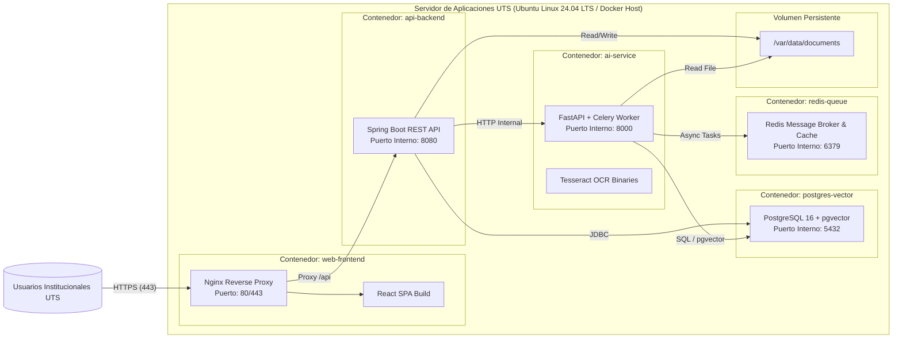
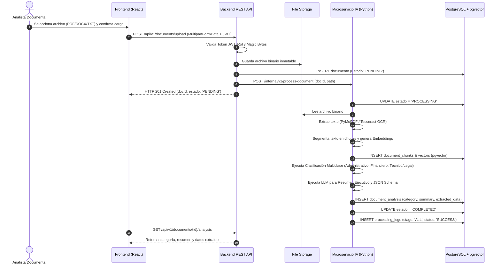
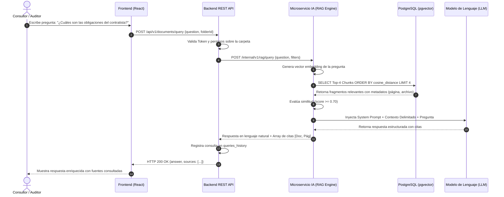

# DOCUMENTO DE ARQUITECTURA DE SOFTWARE (SAD)
## Proyecto: Sistema Inteligente de Gestión y Análisis Documental
### Institución: Unidades Tecnológicas de Santander (UTS)
### Programa: Tecnología en Desarrollo de Software (VI Semestre)
### Versión: 1.0.0 - Línea Base de Diseño

---

## 1. CONTROL DE CAMBIOS Y LÍNEA BASE DE DISEÑO

| Versión | Fecha | Autor(es) | Rol | Descripción del Cambio | Estado |
| :--- | :--- | :--- | :--- | :--- | :--- |
| **1.0.0** | 06/09/2026 | Equipo de Arquitectura UTS | Arquitecto de Software Senior | Definición integral de la arquitectura en microservicios desacoplados, diagramas Mermaid, decisiones ADR y diseño de seguridad. | Aprobado |

---

## 2. VISTA GENERAL DE LA ARQUITECTURA

### 2.1 Patrón Arquitectónico Seleccionado
Para el Sistema Inteligente de Gestión y Análisis Documental de las UTS se selecciona una **Arquitectura de Microservicios Desacoplados Orientada a Servicios y Eventos Ligeros (Service-Oriented & Asynchronous Event-Driven Architecture)**.

**Justificación Técnica:**
1. **Desacoplamiento de Cargas de Trabajo Heterogéneas:** La gestión documental y el control de acceso (CRUD transaccional, autenticación JWT) poseen características de I/O intensivo con baja latencia, ideales para **Java Spring Boot / Node.js**. Por su parte, la extracción de texto, OCR, cálculo de embeddings y generación RAG son intensivos en CPU/GPU y librerías científicas, donde el ecosistema **Python (FastAPI, PyMuPDF, PyTorch, LangChain/LlamaIndex)** es el estándar de facto.
2. **Escalabilidad Independiente:** Permite escalar horizontalmente las réplicas del microservicio de IA durante periodos de alta ingesta de archivos sin sobredimensionar la capa de autenticación o el API Gateway.
3. **Resiliencia y Tolerancia a Fallos:** Las fallas transitorias en la inferencia de modelos o cuotas de LLM no degradan ni bloquean el funcionamiento operativo de la plataforma web ni el acceso a documentos previamente procesados.

### 2.2 Descripción de Capas del Sistema

```
+---------------------------------------------------------------------------------------+
|                               CAPA DE PRESENTACIÓN (SPA)                              |
|                   React.js + Vite / TypeScript / Tailwind CSS / Axios                 |
+---------------------------------------------------------------------------------------+
                                           |  HTTPS / REST (JSON) / WebSockets
                                           v
+---------------------------------------------------------------------------------------+
|                         API GATEWAY & SEGURIDAD (SPRING BOOT)                         |
|           Auth Controller (JWT/RBAC), Folder/Document Manager, Audit Filter           |
+---------------------------------------------------------------------------------------+
                      |                                           |
    Persistencia CRUD |                                           | Disparo Asíncrono / HTTP
                      v                                           v
+-----------------------------+         +-----------------------------------------------+
|     BASE DE DATOS RDBMS     |         |             CAPA DE IA (FASTAPI)              |
|         PostgreSQL          |         |  - Extractor / OCR Engine (Tesseract/PyMuPDF) |
| (Users, Documents, Folders, |         |  - Clasificador Multiclase (ML/LLM)           |
|  Analysis, Logs, History)   |         |  - Motor de Resumen y Extracción JSON Schema  |
+-----------------------------+         |  - Motor RAG (Embeddings + Cosine Similarity) |
              ^                         +-----------------------------------------------+
              |                                                   |
              | SQL / pgvector                                    v
+-----------------------------+         +-----------------------------------------------+
|     VECTOR STORE ENGINE     | <-------+           ALMACENAMIENTO DE ARCHIVOS          |
|  pgvector / Qdrant Storage  |         |   Local Persistent Volume / S3 Compatible     |
+-----------------------------+         +-----------------------------------------------+
```

1. **Capa de Presentación (Frontend):** Desarrollada como una Single Page Application (SPA) responsiva con React, TypeScript y TailwindCSS. Consume los servicios del Backend mediante Axios con interceptores JWT.
2. **Capa de Negocio y Orquestación (Backend REST):** Desarrollada en Java Spring Boot (o FastAPI Core). Gestiona autenticación, autorización RBAC, estructura de carpetas, auditoría y encola las peticiones de análisis de IA.
3. **Capa de Inteligencia Artificial (Microservicio IA):** Implementada en Python con FastAPI y Celery. Ejecuta el pipeline de parsing multiformato (PDF, DOCX, TXT), OCR para escaneos, clasificación multiclase, síntesis ejecutiva, extracción de metadatos JSON y búsqueda semántica RAG.
4. **Capa de Persistencia y Almacenamiento:**
   - **Base de Datos Relacional:** PostgreSQL para datos de usuario, carpetas, registros de auditoría y metadatos documentales.
   - **Vector Database:** Extensión `pgvector` sobre PostgreSQL (o Qdrant) para almacenar embeddings densos (384/1536 dimensiones) e índices de búsqueda HNSW.
   - **Almacenamiento Físico de Archivos:** Volumen persistente seguro montado en el servidor para almacenar los binarios inmutables originales.

---

## 3. DIAGRAMAS ARQUITECTÓNICOS (MERMAID)

### 3.1 Diagrama de Arquitectura General del Sistema



---

### 3.2 Diagrama de Componentes de Software



---

### 3.3 Diagrama de Despliegue en Contenedores (Docker)



---

### 3.4 Diagramas de Secuencia

#### Secuencia 1: Carga, Parseo, Clasificación y Resumen de Documentos


---

#### Secuencia 2: Consulta Semántica en Lenguaje Natural con RAG


---

## 4. DECISIONES TECNOLÓGICAS (ADR - ARCHITECTURE DECISION RECORDS)

| ID ADR | Componente / Decisión | Opción Seleccionada | Alternativas Evaluadas | Justificación Técnica |
| :--- | :--- | :--- | :--- | :--- |
| **ADR-01** | Backend Principal | **Java Spring Boot 3.x / REST** | Node.js (Express), Django, .NET Core | Robustez tipada, ecosistema maduro de seguridad institucional (Spring Security), alto rendimiento transaccional y cumplimiento corporativo. |
| **ADR-02** | Microservicio de IA | **Python 3.11 + FastAPI + Celery** | Flask, Tornado, Go | FastAPI ofrece alto rendimiento asíncrono nativo (ASGI) e interoperabilidad inmediata con las mejores librerías de IA y NLP del mercado. |
| **ADR-03** | Motor de Embeddings | **Sentence-Transformers (`all-MiniLM-L6-v2`)** | OpenAI `text-embedding-3`, Cohere Embed | Ejecución local sin costos de API por token, baja latencia ($<50$ ms por chunk), 384 dimensiones compactas y privacidad de datos. |
| **ADR-04** | Base de Datos & Vector Store | **PostgreSQL 16 + extensión `pgvector`** | Pinecone, ChromaDB independiente, MySQL | Permite unificar datos relacionales transaccionales y vectores en un único motor ACID con soporte de índices HNSW, reduciendo la complejidad de infraestructura. |
| **ADR-05** | Extracción Textual & OCR | **PyMuPDF + python-docx + Tesseract OCR** | Apache Tika, PDFMiner | PyMuPDF es hasta 10x más rápido que PDFMiner; Tesseract 5 provee OCR neural LSTM para PDFs escaneados de alta precisión. |
| **ADR-06** | Frontend Web | **React 18 + TypeScript + TailwindCSS** | Angular, Vue.js | Flexibilidad en componentes modulares, tipado estricto para evitar errores en cliente y desarrollo ágil de interfaces modernas y responsivas. |

---

## 5. DISEÑO DE SEGURIDAD

### 5.1 Manejo de Secretos y Variables de Entorno
- Ninguna clave de API, contraseña de base de datos ni secreto de firma JWT debe residir en el código fuente.
- Se utiliza un archivo `.env` para desarrollo local y variables inyectadas mediante el runtime del orquestador Docker en producción.
- Claves obligatorias gestionadas: `JWT_SECRET_KEY`, `POSTGRES_PASSWORD`, `LLM_API_KEY`, `REDIS_PASSWORD`.

### 5.2 Autorización Basada en Roles (RBAC)
- **ADMIN:** Control total sobre usuarios, carpetas, documentos, métricas del dashboard y logs de auditoría técnica.
- **ANALISTA:** Carga de archivos, creación de carpetas, visualización de clasificaciones y extracción JSON.
- **CONSULTOR / AUDITOR:** Acceso de solo lectura a documentos autorizados y ejecución de consultas semánticas RAG.

### 5.3 Sanitización y Blindaje de Archivos
- **Validación de Magic Bytes:** La cabecera binaria del archivo se verifica en el backend (ej. `%PDF-` para PDF, `PK\x03\x04` para DOCX) para evitar ejecución de binarios maliciosos renombrados.
- **Prevención de Directory Traversal:** Todos los nombres de archivo se sanitizan mediante UUID v4 en el almacenamiento de disco, desvinculando la ruta real del nombre original provisto por el cliente.
- **Límite Estricto de Carga:** Máximo 20 MB por archivo validado en Nginx y en la capa de controladores REST.
