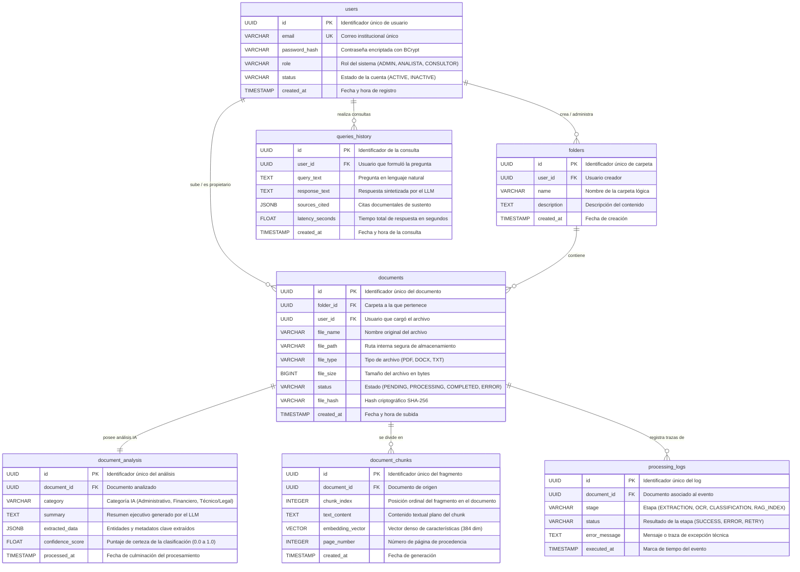

# MODELO Y DICCIONARIO DE DATOS TÉCNICO
## Proyecto: Sistema Inteligente de Gestión y Análisis Documental
### Institución: Unidades Tecnológicas de Santander (UTS)
### Motor de Base de Datos: PostgreSQL 16 + Extensión `pgvector`

---

## 1. DESCRIPCIÓN DEL MODELO DE DATOS

El modelo de datos adopta un **enfoque híbrido relacional-vectorial**:
1. **Núcleo Relacional ACID (PostgreSQL):** Modela con integridad referencial estricta las entidades organizativas institucionales: usuarios (`users`), directorios lógicos (`folders`), documentos cargados (`documents`) y auditoría operativa (`processing_logs`, `queries_history`).
2. **Soporte Semiestructurado NoSQL (JSONB):** La entidad `document_analysis` almacena los metadatos y entidades extraídas por la IA (`extracted_data`) mediante el tipo nativo `JSONB`, permitiendo indexación GIN para búsquedas estructuradas ágiles sin requerir cambios de esquema al variar los tipos de documentos.
3. **Persistencia Vectorial Densa (`pgvector`):** La entidad `document_chunks` almacena los fragmentos de texto normalizados junto a su vector de características (`embedding_vector vector(384)`), permitiendo búsquedas de similitud de coseno indexadas mediante grafos jerárquicos navegables de mundos pequeños (HNSW).

---

## 2. DIAGRAMA ENTIDAD-RELACIÓN (MERMAID ERD)



---

## 3. DICCIONARIO DE DATOS TÉCNICO

### 3.1 Entidad: `users`
Almacena las credenciales, roles y estados de los usuarios del sistema.

| Nombre del Campo | Tipo SQL | Tamaño | Llave | Nulidad | Descripción | Valor por Defecto |
| :--- | :--- | :---: | :---: | :---: | :--- | :--- |
| `id` | `UUID` | 16 bytes | **PK** | NOT NULL | Identificador único universal del usuario | `gen_random_uuid()` |
| `email` | `VARCHAR` | 150 | **UK** | NOT NULL | Correo institucional único del usuario | Ninguno |
| `password_hash` | `VARCHAR` | 255 | Ninguna | NOT NULL | Hash criptográfico de la contraseña (BCrypt) | Ninguno |
| `role` | `VARCHAR` | 20 | Ninguna | NOT NULL | Rol asignado (`ADMIN`, `ANALISTA`, `CONSULTOR`) | `'CONSULTOR'` |
| `status` | `VARCHAR` | 20 | Ninguna | NOT NULL | Estado de la cuenta (`ACTIVE`, `INACTIVE`) | `'ACTIVE'` |
| `created_at` | `TIMESTAMP` | 8 bytes | Ninguna | NOT NULL | Fecha y hora de creación de la cuenta | `CURRENT_TIMESTAMP` |

---

### 3.2 Entidad: `folders`
Estructura las carpetas lógicas para organizar los documentos en el repositorio.

| Nombre del Campo | Tipo SQL | Tamaño | Llave | Nulidad | Descripción | Valor por Defecto |
| :--- | :--- | :---: | :---: | :---: | :--- | :--- |
| `id` | `UUID` | 16 bytes | **PK** | NOT NULL | Identificador único de la carpeta | `gen_random_uuid()` |
| `user_id` | `UUID` | 16 bytes | **FK** | NOT NULL | Referencia al usuario creador (`users.id`) | Ninguno |
| `name` | `VARCHAR` | 100 | Ninguna | NOT NULL | Nombre de la carpeta lógica | Ninguno |
| `description` | `TEXT` | Variable | Ninguna | NULL | Descripción opcional del contenido de la carpeta | `NULL` |
| `created_at` | `TIMESTAMP` | 8 bytes | Ninguna | NOT NULL | Fecha y hora de creación de la carpeta | `CURRENT_TIMESTAMP` |

---

### 3.3 Entidad: `documents`
Almacena los metadatos de los archivos físicos cargados al sistema.

| Nombre del Campo | Tipo SQL | Tamaño | Llave | Nulidad | Descripción | Valor por Defecto |
| :--- | :--- | :---: | :---: | :---: | :--- | :--- |
| `id` | `UUID` | 16 bytes | **PK** | NOT NULL | Identificador único del documento | `gen_random_uuid()` |
| `folder_id` | `UUID` | 16 bytes | **FK** | NOT NULL | Carpeta contenedora (`folders.id`) | Ninguno |
| `user_id` | `UUID` | 16 bytes | **FK** | NOT NULL | Usuario que realizó la carga (`users.id`) | Ninguno |
| `file_name` | `VARCHAR` | 255 | Ninguna | NOT NULL | Nombre original del archivo | Ninguno |
| `file_path` | `VARCHAR` | 500 | Ninguna | NOT NULL | Ruta física o URI de almacenamiento en disco | Ninguno |
| `file_type` | `VARCHAR` | 10 | Ninguna | NOT NULL | Extensión normalizada (`PDF`, `DOCX`, `TXT`) | Ninguno |
| `file_size` | `BIGINT` | 8 bytes | Ninguna | NOT NULL | Tamaño del archivo en bytes | Ninguno |
| `status` | `VARCHAR` | 20 | Ninguna | NOT NULL | Estado (`PENDING`, `PROCESSING`, `COMPLETED`, `ERROR`) | `'PENDING'` |
| `file_hash` | `VARCHAR` | 64 | Ninguna | NOT NULL | Hash SHA-256 para verificación de integridad | Ninguno |
| `created_at` | `TIMESTAMP` | 8 bytes | Ninguna | NOT NULL | Fecha y hora de carga del archivo | `CURRENT_TIMESTAMP` |

---

### 3.4 Entidad: `document_analysis`
Almacena los resultados del procesamiento de IA (clasificación, resumen y entidades).

| Nombre del Campo | Tipo SQL | Tamaño | Llave | Nulidad | Descripción | Valor por Defecto |
| :--- | :--- | :---: | :---: | :---: | :--- | :--- |
| `id` | `UUID` | 16 bytes | **PK** | NOT NULL | Identificador único del análisis | `gen_random_uuid()` |
| `document_id` | `UUID` | 16 bytes | **FK, UK** | NOT NULL | Referencia 1 a 1 con el documento (`documents.id`) | Ninguno |
| `category` | `VARCHAR` | 50 | Ninguna | NOT NULL | Categoría asignada (`Administrativo`, `Financiero`, `Técnico/Legal`) | `'Por Clasificar'` |
| `summary` | `TEXT` | Variable | Ninguna | NOT NULL | Resumen ejecutivo generado por el LLM | Ninguno |
| `extracted_data` | `JSONB` | Variable | Ninguna | NOT NULL | Entidades y atributos extraídos en formato JSON | `'{}'::jsonb` |
| `confidence_score` | `FLOAT` | 4 bytes | Ninguna | NOT NULL | Nivel de confianza del clasificador (0.00 a 1.00) | `0.0` |
| `processed_at` | `TIMESTAMP` | 8 bytes | Ninguna | NOT NULL | Fecha y hora de finalización del análisis | `CURRENT_TIMESTAMP` |

---

### 3.5 Entidad: `document_chunks`
Almacena los fragmentos de texto y sus vectores densos para búsqueda semántica.

| Nombre del Campo | Tipo SQL | Tamaño | Llave | Nulidad | Descripción | Valor por Defecto |
| :--- | :--- | :---: | :---: | :---: | :--- | :--- |
| `id` | `UUID` | 16 bytes | **PK** | NOT NULL | Identificador único del chunk | `gen_random_uuid()` |
| `document_id` | `UUID` | 16 bytes | **FK** | NOT NULL | Documento al que pertenece (`documents.id`) | Ninguno |
| `chunk_index` | `INTEGER` | 4 bytes | Ninguna | NOT NULL | Índice secuencial de fragmentación | Ninguno |
| `text_content` | `TEXT` | Variable | Ninguna | NOT NULL | Contenido del fragmento de texto | Ninguno |
| `embedding_vector` | `VECTOR(384)` | 1536 bytes | Ninguna | NOT NULL | Vector denso de características semánticas | Ninguno |
| `page_number` | `INTEGER` | 4 bytes | Ninguna | NULL | Número de página del documento original | `1` |
| `created_at` | `TIMESTAMP` | 8 bytes | Ninguna | NOT NULL | Fecha y hora de indexación | `CURRENT_TIMESTAMP` |

---

### 3.6 Entidad: `processing_logs`
Almacena el registro histórico y trazas de error de cada etapa del pipeline de IA.

| Nombre del Campo | Tipo SQL | Tamaño | Llave | Nulidad | Descripción | Valor por Defecto |
| :--- | :--- | :---: | :---: | :---: | :--- | :--- |
| `id` | `UUID` | 16 bytes | **PK** | NOT NULL | Identificador del registro de log | `gen_random_uuid()` |
| `document_id` | `UUID` | 16 bytes | **FK** | NOT NULL | Documento afectado (`documents.id`) | Ninguno |
| `stage` | `VARCHAR` | 50 | Ninguna | NOT NULL | Etapa (`EXTRACTION`, `OCR`, `CLASSIFICATION`, `RAG_INDEX`) | Ninguno |
| `status` | `VARCHAR` | 20 | Ninguna | NOT NULL | Resultado (`SUCCESS`, `ERROR`, `RETRY`) | Ninguno |
| `error_message` | `TEXT` | Variable | Ninguna | NULL | Detalle del error o traza de excepción | `NULL` |
| `executed_at` | `TIMESTAMP` | 8 bytes | Ninguna | NOT NULL | Marca de tiempo del evento | `CURRENT_TIMESTAMP` |

---

### 3.7 Entidad: `queries_history`
Almacena las preguntas de los usuarios y las respuestas fundamentadas del motor RAG.

| Nombre del Campo | Tipo SQL | Tamaño | Llave | Nulidad | Descripción | Valor por Defecto |
| :--- | :--- | :---: | :---: | :---: | :--- | :--- |
| `id` | `UUID` | 16 bytes | **PK** | NOT NULL | Identificador único de la consulta | `gen_random_uuid()` |
| `user_id` | `UUID` | 16 bytes | **FK** | NOT NULL | Usuario que realizó la pregunta (`users.id`) | Ninguno |
| `query_text` | `TEXT` | Variable | Ninguna | NOT NULL | Texto de la pregunta en lenguaje natural | Ninguno |
| `response_text` | `TEXT` | Variable | Ninguna | NOT NULL | Respuesta generada por el LLM | Ninguno |
| `sources_cited` | `JSONB` | Variable | Ninguna | NOT NULL | Array de fragmentos y documentos citados | `'[]'::jsonb` |
| `latency_seconds`| `FLOAT` | 4 bytes | Ninguna | NOT NULL | Latencia total de la consulta en segundos | `0.0` |
| `created_at` | `TIMESTAMP` | 8 bytes | Ninguna | NOT NULL | Fecha y hora de la consulta | `CURRENT_TIMESTAMP` |

---

## 4. INTEGRIDAD REFERENCIAL Y RESTRICCIONES (CONSTRAINTS)

### 4.1 Claves Foráneas y Acciones en Cascada
- `folders.user_id` $\rightarrow$ `users.id` (`ON DELETE RESTRICT`): No se permite eliminar un usuario si posee carpetas activas.
- `documents.folder_id` $\rightarrow$ `folders.id` (`ON DELETE RESTRICT`): Las carpetas con documentos no pueden eliminarse sin vaciar previamente su contenido.
- `documents.user_id` $\rightarrow$ `users.id` (`ON DELETE RESTRICT`).
- `document_analysis.document_id` $\rightarrow$ `documents.id` (`ON DELETE CASCADE`): Al eliminar un documento, se elimina automáticamente su análisis asociado.
- `document_chunks.document_id` $\rightarrow$ `documents.id` (`ON DELETE CASCADE`): Al eliminar un documento, se purgan automáticamente todos sus chunks y vectores.
- `processing_logs.document_id` $\rightarrow$ `documents.id` (`ON DELETE CASCADE`).
- `queries_history.user_id` $\rightarrow$ `users.id` (`ON DELETE CASCADE`).

### 4.2 Restricciones de Dominio (Check Constraints)
```sql
ALTER TABLE users ADD CONSTRAINT chk_user_role CHECK (role IN ('ADMIN', 'ANALISTA', 'CONSULTOR'));
ALTER TABLE users ADD CONSTRAINT chk_user_status CHECK (status IN ('ACTIVE', 'INACTIVE'));
ALTER TABLE documents ADD CONSTRAINT chk_doc_file_type CHECK (file_type IN ('PDF', 'DOCX', 'TXT'));
ALTER TABLE documents ADD CONSTRAINT chk_doc_status CHECK (status IN ('PENDING', 'PROCESSING', 'COMPLETED', 'ERROR'));
ALTER TABLE document_analysis ADD CONSTRAINT chk_analysis_category CHECK (category IN ('Administrativo', 'Financiero', 'Técnico/Legal', 'Por Clasificar'));
ALTER TABLE document_analysis ADD CONSTRAINT chk_confidence_range CHECK (confidence_score >= 0.0 AND confidence_score <= 1.0);
ALTER TABLE processing_logs ADD CONSTRAINT chk_log_status CHECK (status IN ('SUCCESS', 'ERROR', 'RETRY'));
```

### 4.3 Índices de Aceleración y Rendimiento
```sql
-- Índices B-Tree para optimización de búsquedas relacionales y filtros
CREATE INDEX idx_documents_folder_id ON documents(folder_id);
CREATE INDEX idx_documents_status ON documents(status);
CREATE INDEX idx_documents_created_at ON documents(created_at DESC);
CREATE INDEX idx_document_analysis_category ON document_analysis(category);
CREATE INDEX idx_document_chunks_document_id ON document_chunks(document_id);

-- Índice GIN para consultas rápidas sobre el JSONB de entidades extraídas
CREATE INDEX idx_document_analysis_extracted_data ON document_analysis USING gin (extracted_data);

-- Índice HNSW para aceleración de búsqueda vectorial por similitud de coseno
CREATE INDEX idx_document_chunks_embedding_hnsw 
ON document_chunks 
USING hnsw (embedding_vector vector_cosine_ops)
WITH (m = 16, ef_construction = 64);
```
