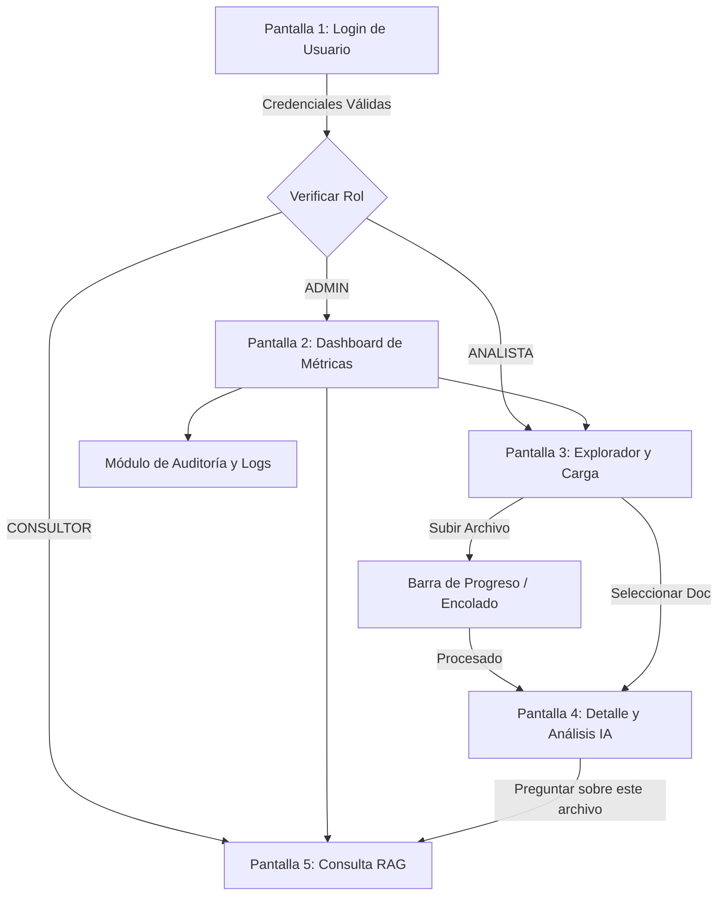

# GUÍA DE DISEÑO DE INTERFAZ, MOCKUPS Y UX
## Proyecto: Sistema Inteligente de Gestión y Análisis Documental
### Institución: Unidades Tecnológicas de Santander (UTS)
### Estándar: Heurísticas de Nielsen / Diseño Atómico & WCAG 2.1 AA

---

## 1. DIRECTRICES DE DISEÑO Y GUÍA DE ESTILOS (UI/UX)

### 1.1 Paleta Cromática Institucional UTS y Semántica
La interfaz adopta la identidad visual de las Unidades Tecnológicas de Santander complementada con colores semánticos para estados del pipeline de IA:

| Color / Rol | Código HEX | RGB | Uso Principal |
| :--- | :---: | :---: | :--- |
| **Verde Institucional UTS (Primario)** | `#1B5E20` | `27, 94, 32` | Botones de acción principal, acentos de marca y cabeceras |
| **Azul Profundo UTS (Secundario)** | `#0E387A` | `14, 56, 122` | Barra lateral de navegación, enlaces activos y títulos |
| **Gris Fondo / Neutro Claro** | `#F8FAFC` | `248, 250, 252` | Fondo general de la aplicación |
| **Gris Superficie / Cards** | `#FFFFFF` | `255, 255, 255` | Fondos de tarjetas, modales y tablas |
| **Gris Texto Principal** | `#1E293B` | `30, 41, 59` | Tipografía principal y títulos |
| **Estado: Completado / Éxito** | `#16A34A` | `22, 163, 74` | Badges de estado `COMPLETED` y alertas de éxito |
| **Estado: En Proceso / Alerta** | `#EAB308` | `234, 179, 8` | Badges de estado `PROCESSING` y advertencias |
| **Estado: Error / Crítico** | `#DC2626` | `220, 38, 38` | Badges de estado `ERROR` y mensajes de validación |

### 1.2 Tipografía e Iconografía
- **Familia Tipográfica:** *Inter* / *Roboto* (Google Fonts) para alta legibilidad en pantallas retina y estándar.
- **Escala Modular:** H1: 24px (Bold), H2: 18px (SemiBold), H3: 15px (Medium), Body: 14px (Regular), Caption/Badges: 12px (Medium).
- **Librería de Iconos:** *Lucide-React* (iconos vectoriales limpios y consistentes de 20x20px).

### 1.3 Principios de Diseño Responsivo
- Diseño basado en cuadrícula fluida de 12 columnas (*CSS Grid / Flexbox*).
- Puntos de ruptura (*Breakpoints*): Mobile ($<768$px - menú colapsable), Tablet ($768$px-$1024$px) y Desktop ($>1024$px - barra lateral fija).

---

## 2. ESPECIFICACIÓN DETALLADA DE PANTALLAS (MOCKUPS ESTRUCTURALES)

---

### Pantalla 1: Login / Acceso de Usuarios
- **Objetivo:** Autenticar al usuario institucional de forma clara y segura.
- **Componentes:**
  - Panel izquierdo: Ilustración y banner institucional UTS ("Sistema Inteligente de Gestión y Análisis Documental").
  - Panel derecho: Formulario de login con campos: Correo Electrónico Institucional (`@uts.edu.co`), Contraseña con botón de alternar visibilidad (ojo), botón "Iniciar Sesión" y enlace de recuperación.

```
+---------------------------------------------------------------------------------+
|                                 ACCESO AL SISTEMA                               |
+------------------------------------+--------------------------------------------+
|                                    |                                            |
|   [LOGO UTS]                       |   Iniciar Sesión                           |
|   Unidades Tecnológicas            |   Ingresa tus credenciales institucionales |
|   de Santander                     |                                            |
|                                    |   Correo Institucional:                    |
|   Sistema Inteligente de           |   [ analista@uts.edu.co                  ] |
|   Gestión y Análisis               |                                            |
|   Documental                       |   Contraseña:                              |
|                                    |   [ ****************                 (o) ] |
|   "Transformando repositorios      |                                            |
|   pasivos en conocimiento activo"  |   [   INICIAR SESIÓN (Verde UTS)   ]       |
|                                    |                                            |
|                                    |   ¿Olvidaste tu contraseña? Soporte TI     |
+------------------------------------+--------------------------------------------+
```

---

### Pantalla 2: Dashboard Principal
- **Objetivo:** Ofrecer una visión ejecutiva inmediata del estado del repositorio, métricas del pipeline y actividad reciente.
- **Componentes:**
  - 4 Tarjetas de Métricas (KPIs): Total Documentos (1,420), Tasa de Éxito (98.2%), Tiempo Promedio de IA (4.1s), Almacenamiento (3.48 GB).
  - Gráfica de distribución por categorías (Administrativo: 44%, Financiero: 34%, Técnico/Legal: 22%).
  - Tabla de últimos documentos procesados con badge de estado en tiempo real.

```
+---------------------------------------------------------------------------------+
| UTS Documental | [Buscar...]                    (Notif) [Laura Gómez - Analista]|
+--------------+------------------------------------------------------------------+
| (o) Dashboard|  Dashboard de Analítica Documental                               |
| [ ] Carpetas |  +-------------------+ +-------------------+ +------------------+|
| [ ] Subir    |  | Total Documentos  | | Tasa Éxito IA     | | Tiempo Medio IA  ||
| [?] Chat RAG |  | 1,420             | | 98.2 %            | | 4.15 segundos    ||
| [!] Auditoría|  +-------------------+ +-------------------+ +------------------+|
|              |                                                                  |
|              |  Distribución por Categorías        Actividad Reciente           |
|              |  +--------------------------------+ +---------------------------+|
|              |  | [===] Administrativo (44%)     | | Resolucion_045.pdf [OK]   ||
|              |  | [== ] Financiero (34%)         | | Contrato_TIC.docx  [OK]   ||
|              |  | [=  ] Técnico/Legal (22%)      | | Tesis_Redes.pdf    [PROC] ||
|              |  +--------------------------------+ +---------------------------+|
+--------------+------------------------------------------------------------------+
```

---

### Pantalla 3: Explorador de Repositorios y Carga Documental
- **Objetivo:** Permitir la navegación de carpetas y la carga masiva de archivos con validación en tiempo real.
- **Componentes:**
  - Panel izquierdo: Árbol de carpetas lógicas con botones para crear y organizar.
  - Panel derecho superior: Zona interactiva Drag & Drop para arrastrar archivos PDF, DOCX y TXT ($\le 20$ MB) con barra de progreso reactiva.
  - Panel derecho inferior: Tabla de archivos contenidos con tamaño, tipo, fecha y estado de procesamiento.

```
+---------------------------------------------------------------------------------+
| Repositorio Documental > Actas_y_Resoluciones_2026           [+ Nueva Carpeta]  |
+----------------------+----------------------------------------------------------+
| CARPETAS             |  ZONA DE CARGA DE ARCHIVOS (PDF, DOCX, TXT <= 20MB)      |
| v Repositorio Raiz   |  +----------------------------------------------------+  |
|   > Proyectos_Grado  |  |    [Icono Upload] Arrastra tus archivos aquí       |  |
|   v Actas_y_Resol    |  |    o haz clic para explorar en tu equipo           |  |
|     - Consejo_2026   |  +----------------------------------------------------+  |
|   > Contratos        |  Subiendo: Acta_Comite_08.docx [=========>  ] 78%        |
|                      |                                                          |
|                      |  Archivos en esta carpeta:                               |
|                      |  Nombre Archivo        Tipo    Tamaño   Estado    Acción |
|                      |  Resolucion_045.pdf    PDF     4.5 MB   [COMPLETED] [Ver]|
|                      |  Acta_Comite_07.docx   DOCX    1.2 MB   [COMPLETED] [Ver]|
|                      |  Plan_Sistemas.txt     TXT     180 KB   [COMPLETED] [Ver]|
+----------------------+----------------------------------------------------------+
```

---

### Pantalla 4: Vista de Detalle Documental y Análisis de IA
- **Objetivo:** Mostrar los resultados de inferencia de IA para un archivo específico.
- **Componentes:**
  - Cabecera: Nombre de archivo, hash SHA-256, tamaño y Badge de Categoría asignada (`Financiero`, `Administrativo`, etc.).
  - Columna izquierda: Resumen ejecutivo generado por el LLM en formato enriquecido.
  - Columna derecha: Tarjeta con Entidades Extraídas en formato clave-valor y visor de trazas de procesamiento/auditoría.

```
+---------------------------------------------------------------------------------+
| Detalle de Documento: Resolucion_Rectoral_045.pdf       [Categoría: FINANCIERO] |
+---------------------------------------------------------------------------------+
| [Resumen Ejecutivo (IA)]                 | [Datos Clave Extraídos (JSON)]       |
|                                          |                                      |
| La Resolución Rectoral 045 aprueba la    | - N° Resolución: 045-2026            |
| asignación de recursos presupuestales    | - Emisor: Rectoría UTS               |
| para los laboratorios de software de las | - Fecha: 15 de Agosto de 2026        |
| UTS por un valor de $120.000.000 COP,    | - Monto: $120.000.000 COP            |
| designando como responsable a la         | - Responsable: Vicerrectoría Admin   |
| Vicerrectoría Administrativa.            |--------------------------------------|
|                                          | [Trazas de Auditoría]                |
| Puntos Clave:                            | [OK] Extracción Textual (0.4s)       |
| 1. Modernización de 40 estaciones de TI  | [OK] Embeddings & Indexación (1.1s)  |
| 2. Plazo de ejecución: 90 días calendario| [OK] Clasificación Multiclase (0.8s) |
+---------------------------------------------------------------------------------+
```

---

### Pantalla 5: Módulo de Consulta Inteligente (Chatbot RAG)
- **Objetivo:** Permitir al usuario realizar preguntas en lenguaje natural sobre el repositorio y recibir respuestas contextualizadas con citas de origen.
- **Componentes:**
  - Selector de alcance: Filtro por carpeta o todo el repositorio institucional.
  - Área de mensajes: Historial conversacional con burbujas de usuario y asistente.
  - Cita interactiva: Tarjeta lateral desplegable que muestra la página exacta y el texto fuente del documento.
  - Barra de entrada de texto inferior con botón de envío y sugerencias automáticas.

```
+---------------------------------------------------------------------------------+
| Consulta Inteligente RAG | Alcance: [Todas las Carpetas v]        [Limpiar Chat]|
+---------------------------------------------------------------------------------+
|                                                                                 |
|  (Usuario): ¿Cuál es el presupuesto aprobado para los laboratorios de software? |
|                                                                                 |
|  (Asistente IA UTS):                                                            |
|  El presupuesto aprobado para los laboratorios de desarrollo de software es de  |
|  $120.000.000 COP, según lo estipulado en la resolución de rectoría.            |
|                                                                                 |
|  +----------------------------------------------------------------------------+ |
|  | Fuentes de Sustento:                                                       | |
|  | [*] Resolucion_Rectoral_045.pdf - Página 2, Párrafo 1                      | |
|  |     "...aprobar el rubro de $120.000.000 COP para infraestructura..."      | |
|  +----------------------------------------------------------------------------+ |
|                                                                                 |
| +-----------------------------------------------------------------------------+ |
| | Escribe una pregunta sobre los documentos...                      [ ENVIAR ]| |
| +-----------------------------------------------------------------------------+ |
+---------------------------------------------------------------------------------+
```

---

## 3. MAPA DE NAVEGACIÓN Y FLUJO DE USUARIO



---

## 4. MATRIZ DE COMPONENTES REUTILIZABLES

| Componente UI | Propósito | Estados Visuales | Props Principales |
| :--- | :--- | :--- | :--- |
| `Button` | Ejecución de acciones primarias y secundarias | Default, Hover, Active, Disabled, Loading (Spinner) | `variant: 'primary' \| 'secondary' \| 'danger'`, `size`, `onClick` |
| `StatusBadge` | Indicador visual del estado del documento | `PENDING` (Gris), `PROCESSING` (Amarillo), `COMPLETED` (Verde), `ERROR` (Rojo) | `status: DocumentStatus`, `size: 'sm' \| 'md'` |
| `FileDropzone` | Área de arrastre para carga de PDF/DOCX/TXT | Idle, DragOver, Uploading, Error | `maxSize: 20MB`, `allowedTypes: ['pdf','docx','txt']`, `onFilesSelected` |
| `SourceCitationCard` | Tarjeta interactiva para citas documentales RAG | Colapsada, Expandida, Hover | `documentName`, `pageNumber`, `snippetText`, `onClick` |
| `Modal` | Diálogo emergente para confirmaciones y nueva carpeta | Abierto, Cerrado (Animación Fade/Slide) | `isOpen: boolean`, `title: string`, `onClose: () => void` |
| `ToastAlert` | Notificaciones flotantes de éxito o error | Success, Error, Warning, Info | `type: ToastType`, `message: string`, `duration: 4000ms` |
